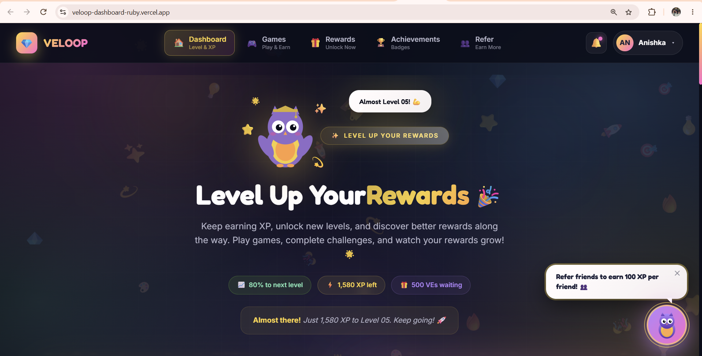
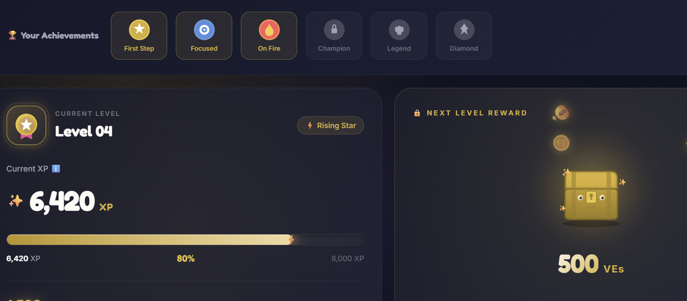
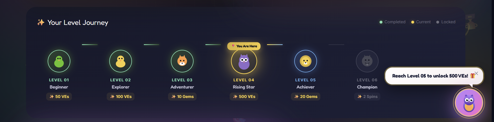
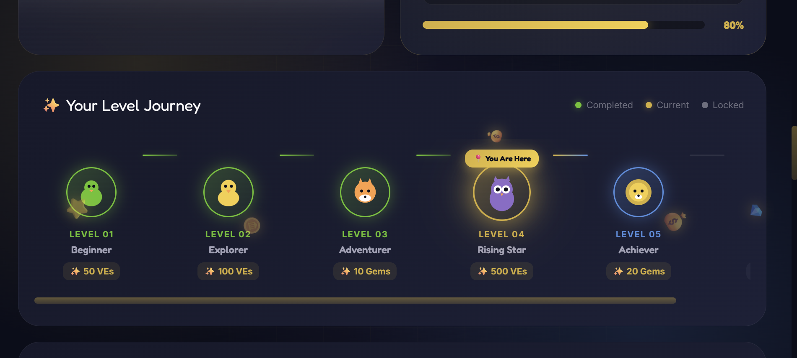
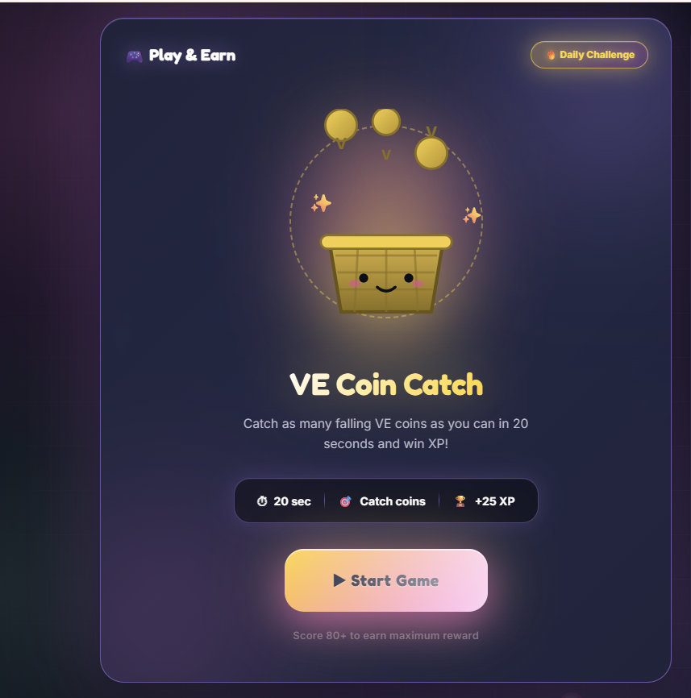
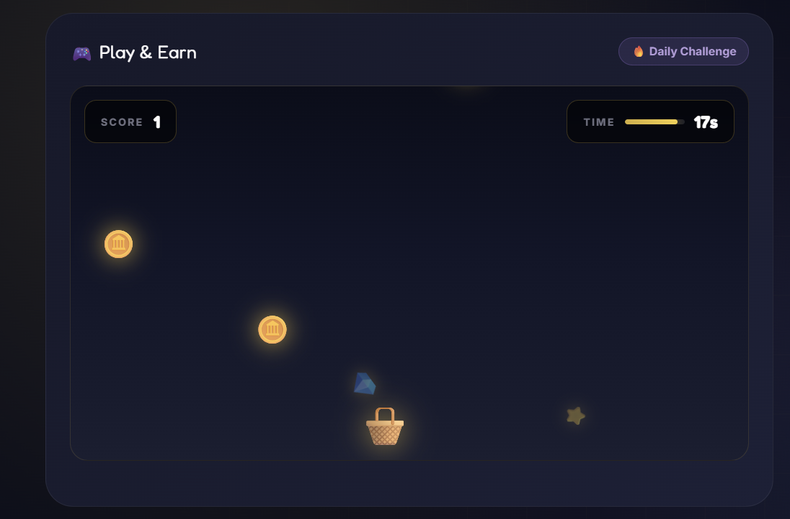
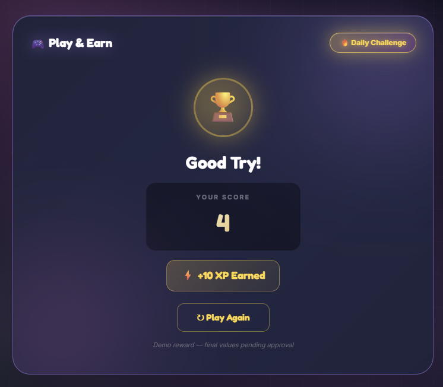
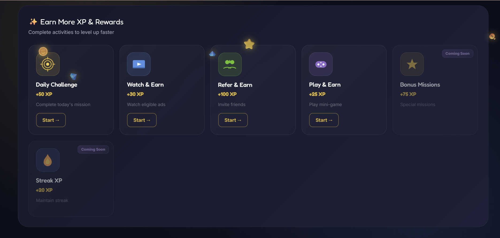
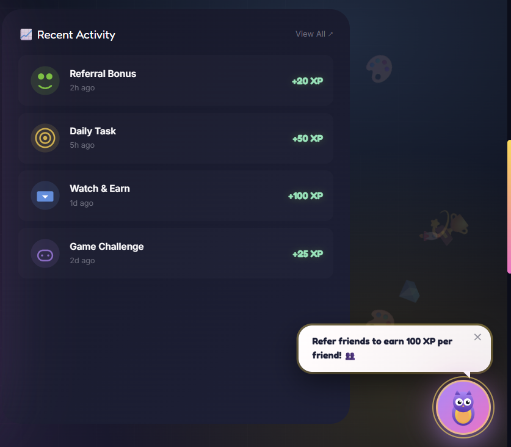

# 🎮 VELOOP Rewards — Level-Up Dashboard

> A premium gamified rewards dashboard with XP progression, mini-game, and earning hub — built with React + Vite + CSS Modules.


---

## 📖 Table of Contents

- [Project Overview](#-project-overview)
- [Live Demo](#-live-demo)
- [Key Features](#-key-features)
- [Level System](#-level-system)
- [XP System](#-xp-system)
- [Next-Level Rewards](#-next-level-rewards)
- [Game Concept](#-game-concept)
- [Game Rules](#-game-rules)
- [Earning Features](#-earning-features)
- [Technology Stack](#-technology-stack)
- [Installation](#-installation)
- [Development Commands](#-development-commands)
- [Folder Structure](#-folder-structure)
- [Component Architecture](#-component-architecture)
- [Responsive Behavior](#-responsive-behavior)
- [Animation Details](#-animation-details)
- [Screenshots](#-screenshots)
- [Future Roadmap](#-future-roadmap)
- [Author](#-author)
- [License](#-license)

---

## 🎯 Project Overview

The **VELOOP Rewards Level-Up Dashboard** is a complete redesign of the existing level tracker — transformed into a premium gamified progression hub where users have a reason to return: **level up, play, earn, and unlock rewards.**

### Design Philosophy

The dashboard blends **premium fintech design** with **gamified engagement**:

- ✅ **Fintech-inspired** — trustworthy, sophisticated, clean
- ✅ **Gamified** — levels, XP, rewards, achievements, mini-game
- ✅ **Interactive** — animations, hover effects, real gameplay
- ✅ **Motivating** — progress visualization, next-reward anticipation
- ✅ **Not childish** — no casino aesthetics, no neon chaos
- ✅ **Fully responsive** — mobile-first, tablet, desktop

### Core User Questions Answered

| Question | Where It's Answered |
|----------|---------------------|
| Where am I now? | **Current Level** card |
| How far have I progressed? | **XP Progress** bar |
| What do I need next? | **XP Remaining** counter |
| What will I receive? | **Next Level Reward** (locked) |
| What level comes next? | **Level Roadmap** |
| What can I do right now? | **Play & Earn** mini-game |
| Why should I return? | **Earn More XP** section |

---

## 🚀 Live Demo

🔗 **[View Live Dashboard](https://veloop-dashboard-ruby.vercel.app)**

📦 **[GitHub Repository](https://github.com/anishka021/veloop-dashboard)**

---

## ✨ Key Features

### 🏅 Level System
- Current level prominently displayed with custom SVG badge
- Level name (e.g., "Rising Star") with animated pill
- Visual level roadmap (6 levels) with distinct states
- **Completed** ✅ / **Current** 🟡 / **Next** 🔵 / **Locked** 🔒
- "You Are Here" floating badge with pulse animation
- Level-specific custom animal characters (🐦🐥🦊🦉🦁🐉)
- Rewards shown for each level

### 📊 XP System
- Animated XP counter (0 → 6,420)
- Smooth progress bar animation
- Visual indicator of XP remaining
- Recent XP activity feed with custom icons
- Clear XP source attribution

### 🎁 Next-Level Rewards
- Locked reward visualization with custom cartoon chest SVG
- Blinking eyes + heartbeat animation
- "Reach Level X to unlock" message
- Mini progress bar showing unlock percentage
- Interactive click (wiggle + confetti burst)
- Premium glassmorphism card design

### 🎮 Play & Earn Mini-Game
- **VE Coin Catch** — 20-second skill-based game
- Functional gameplay with score tracking
- Timer with visual bar
- Score-based reward system (10/15/25 XP)
- Celebration animation on high score
- Start → Play → Result → Replay flow
- **Touch + Mouse support** (mobile-friendly)
- Confetti burst on game start
- Custom SVG basket character with face

### ⚡ Earn More XP
- 6 interactive earning opportunity cards
- Daily Challenge, Watch & Earn, Refer & Earn, Play & Earn
- "Coming Soon" badges for unsupported features
- Custom SVG icons for each category
- Color-coded categories (gold, blue, green, purple)
- Hover animations with icon wiggles
- Confetti burst on card click

### 🏆 Achievements Strip
- 6 unlockable badge slots
- Custom SVG badges (star, target, flame, lock, key, diamond)
- Unlocked vs Locked visual states

### 🎨 Premium UI/UX
- Aurora gradient animated background
- Glassmorphism card design with backdrop blur
- Custom SVG owl mascot with flapping wings
- Speech bubble with rotating messages
- Mouse sparkle trail effect
- Coin rain animation (every 6 seconds)
- Bounce-in animations for sections
- Rainbow gradient text animation
- Heartbeat animations on key elements
- Smooth hover transitions
- Custom scrollbar
- Text glow effects

### 📱 Fully Responsive
- **Mobile:** 320px+
- **Tablet:** 768px+
- **Laptop:** 1280px+
- **Desktop:** 1440px+
- **Large Screens:** 1920px+

### ♿ Accessibility
- Semantic HTML structure
- Focus states for interactive elements
- Sufficient color contrast
- Keyboard navigation support

---

## 🎚️ Level System

Users progress through levels by earning XP. Each level unlocks new rewards and experiences.

| Level | Name | Reward | Status | Character |
|-------|------|--------|--------|-----------|
| 01 | Beginner | 50 VEs | ✅ Completed | 🐦 |
| 02 | Explorer | 100 VEs | ✅ Completed | 🐥 |
| 03 | Adventurer | 10 Gems | ✅ Completed | 🦊 |
| **04** | **Rising Star** | **500 VEs** | **🟡 Current** | **🦉** |
| 05 | Achiever | 20 Gems | 🔵 Next | 🦁 |
| 06 | Champion | 2 Spins | 🔒 Locked | 🐉 |

### Level States

- **Completed** — Green checkmark, custom SVG animal, dimmed style
- **Current** — Gold pulsing node, rotating ring, "You Are Here" badge
- **Next** — Blue glowing node with bounce animation
- **Locked** — Grayed out with opacity reduction

---

## 💎 XP System

### Current User Data (Demo)

```
Current Level:    Level 04 (Rising Star)
Current XP:       6,420 XP
Required XP:      8,000 XP (for Level 05)
Remaining XP:     1,580 XP
Progress:         80%
```

### XP Sources

- 🎯 **Daily Challenge** — +50 XP
- 📺 **Watch & Earn** — +30 XP
- 👥 **Refer & Earn** — +100 XP
- 🎮 **Play & Earn** — +25 XP
- ⭐ **Bonus Missions** — +75 XP *(Coming Soon)*
- 🔥 **Streak XP** — +20 XP *(Coming Soon)*

> ⚠️ **Note:** All XP values are **development/demo placeholders** and will be replaced with actual backend values.

---

## 🎁 Next-Level Rewards

The next-level reward is displayed as a **locked chest** to create anticipation:

- **Current Next Reward:** 500 VEs
- **Unlock Condition:** Reach Level 05
- **Progress:** 80% (visual indicator)
- **Interaction:** Click chest → wiggle animation + confetti burst

> 📌 Displayed rewards are associated with the next level according to current reward configuration. Actual values are subject to backend approval.

---

## 🎮 Game Concept

### VE Coin Catch

A short, skill-based mini-game where users catch falling VE coins.

**Why this game?**
- ✅ Skill-based (not gambling)
- ✅ Quick (20 seconds per round)
- ✅ Reward-focused
- ✅ Mobile-friendly (touch + mouse)
- ✅ Age-appropriate

### Game Mechanics

- User controls a basket (🧺) at the bottom of the play area
- VE coins (🪙) fall from the top at random intervals
- Player moves the basket left/right to catch coins
- Each coin caught = +1 to score
- Game lasts 20 seconds
- At the end, user sees result + XP reward

---

## 📜 Game Rules

| Rule | Details |
|------|---------|
| **Objective** | Catch as many VE coins as possible |
| **Duration** | 20 seconds per round |
| **Controls** | Mouse move / touch move (mobile) |
| **Reward** | Score-based XP (see below) |
| **Attempts** | Unlimited (demo) — production rule TBD |
| **Eligibility** | All registered VELOOP Rewards users |

### Reward Tiers

| Score | Reward |
|-------|--------|
| **80+** | +25 XP |
| **50–79** | +15 XP |
| **0–49** | +10 XP |

> ⚠️ **Note:** Reward values are **demo placeholders**. Final reward logic will be determined by the product team and integrated with backend.

### Safety & Trust

- ❌ No gambling mechanics
- ❌ No betting
- ❌ No jackpot system
- ❌ No casino aesthetics
- ✅ Skill-based interaction
- ✅ Transparent reward structure
- ✅ Consistent with VELOOP brand

---

## ⚡ Earning Features

### Implemented

| Feature | Reward | Description | Status |
|---------|--------|-------------|--------|
| 🎯 Daily Challenge | +50 XP | Complete today's mission | ✅ Active |
| 📺 Watch & Earn | +30 XP | Watch eligible ads | ✅ Active |
| 👥 Refer & Earn | +100 XP | Invite friends | ✅ Active |
| 🎮 Play & Earn | +25 XP | Play mini-game | ✅ Active |

### Coming Soon

| Feature | Reward | Description | Status |
|---------|--------|-------------|--------|
| ⭐ Bonus Missions | +75 XP | Complete special missions | 🔜 Coming Soon |
| 🔥 Streak XP | +20 XP | Maintain daily engagement streak | 🔜 Coming Soon |
| 🎯 XP Challenge | TBD | Complete specific activity | 🔜 Coming Soon |
| 🏆 Weekly Quest | TBD | Complete weekly objective | 🔜 Coming Soon |
| 🧩 Quick Quiz | TBD | Answer questions correctly | 🔜 Coming Soon |
| 🔍 Reward Hunt | TBD | Find hidden reward elements | 🔜 Coming Soon |

---

## 🛠️ Technology Stack

| Technology | Purpose |
|------------|---------|
| **React 18.3** | UI library |
| **Vite 8.3** | Build tool & dev server |
| **Bootstrap 5.3** | Base grid & utilities |
| **CSS Modules** | Scoped component styling |
| **React Icons** | Icon library |
| **Lucide React** | Modern icon set |
| **React Router DOM** | Routing (future-ready) |
| **Google Fonts** | Inter + Fredoka typography |

---

## 📦 Installation

### Prerequisites

- Node.js **v18+** — [Download](https://nodejs.org)
- npm or yarn
- Git

### Setup

```bash
# 1. Clone the repository
git clone https://github.com/anishka021/veloop-dashboard.git

# 2. Navigate into the project
cd veloop-dashboard

# 3. Install dependencies
npm install

# 4. Start development server
npm run dev
```

Open **http://localhost:5173** in your browser.

---

## 🎬 Development Commands

| Command | Description |
|---------|-------------|
| `npm run dev` | Start dev server with HMR |
| `npm run build` | Create production build in `dist/` |
| `npm run preview` | Preview production build locally |
| `npm run lint` | Run ESLint on all files |

---

## 📁 Folder Structure

```
veloop-dashboard/
├── public/
├── screenshots/              ← Screenshots folder
│   ├── current-level.png
│   ├── desktop.png
│   ├── earnmoreXP.png
│   ├── game-end.png
│   ├── game-play.png
│   ├── game-start.png
│   ├── level.png
│   ├── levels.png
│   └── recent-activity.png
├── src/
│   ├── components/
│   │   ├── AchievementsStrip/
│   │   │   ├── AchievementsStrip.jsx
│   │   │   └── AchievementsStrip.module.css
│   │   ├── CoinRain/
│   │   │   └── CoinRain.jsx
│   │   ├── CurrentLevel/
│   │   │   ├── CurrentLevel.jsx
│   │   │   └── CurrentLevel.module.css
│   │   ├── EarnMoreXP/
│   │   │   ├── EarnMoreXP.jsx
│   │   │   └── EarnMoreXP.module.css
│   │   ├── Icons/
│   │   │   └── SvgIcons.jsx
│   │   ├── LevelHero/
│   │   │   ├── LevelHero.jsx
│   │   │   └── LevelHero.module.css
│   │   ├── LevelRoadmap/
│   │   │   ├── LevelRoadmap.jsx
│   │   │   └── LevelRoadmap.module.css
│   │   ├── LevelUpModal/
│   │   ├── NextLevelReward/
│   │   │   ├── NextLevelReward.jsx
│   │   │   └── NextLevelReward.module.css
│   │   ├── PlayAndEarn/
│   │   │   ├── GameContainer/
│   │   │   ├── GamePlay/
│   │   │   ├── GameResult/
│   │   │   └── GameStart/
│   │   ├── SparkleTrail/
│   │   │   └── SparkleTrail.jsx
│   │   ├── XPActivity/
│   │   │   ├── XPActivity.jsx
│   │   │   └── XPActivity.module.css
│   │   └── XPProgress/
│   │       ├── XPProgress.jsx
│   │       └── XPProgress.module.css
│   ├── data/
│   │   └── levelData.js
│   ├── pages/
│   │   └── LevelDashboard/
│   │       ├── LevelDashboard.jsx
│   │       └── LevelDashboard.module.css
│   ├── App.jsx
│   ├── index.css
│   └── main.jsx
├── .gitignore
├── index.html
├── package.json
├── package-lock.json
├── vite.config.js
└── README.md
```

---

## 🧩 Component Architecture

| Component | Purpose |
|-----------|---------|
| `LevelHero` | Hero section with owl mascot, badge, gradient heading |
| `AchievementsStrip` | Unlockable achievement badges display |
| `CurrentLevel` | Displays current level, XP, animated counter |
| `XPProgress` | Progress bar with shimmer and sparkle effects |
| `NextLevelReward` | Locked reward chest with pulse animation |
| `LevelRoadmap` | Horizontal level progression timeline with animals |
| `PlayAndEarn` | Game container with Start/Play/Result states |
| `EarnMoreXP` | Grid of earning opportunity cards |
| `XPActivity` | Recent XP activity feed |
| `SparkleTrail` | Mouse-follow sparkle effect |
| `CoinRain` | Background coin rain animation |
| `Icons/SvgIcons` | All custom SVG characters and icons |

### Design Principles

- ✅ **Reusable components** — no monolithic files
- ✅ **CSS Modules** — scoped styling, no conflicts
- ✅ **Props-driven** — components accept data via props
- ✅ **Separation of concerns** — UI separate from data
- ✅ **Custom SVG icons** — no external image dependencies

---

## 📱 Responsive Behavior

| Breakpoint | Width | Layout Changes |
|------------|-------|----------------|
| **Mobile S** | 320px+ | Single column, reduced padding |
| **Mobile L** | 480px+ | Single column, optimized spacing |
| **Tablet** | 768px+ | 2-column grids begin |
| **Laptop** | 1024px+ | Full grid layout restored |
| **Desktop** | 1440px+ | Maximum content width |
| **Large** | 1920px+ | Centered container |

### Mobile Hierarchy

```
Level Hero
   ↓
Achievements
   ↓
Current XP
   ↓
Next Level Reward
   ↓
Level Roadmap (horizontal scroll)
   ↓
Play & Earn
   ↓
XP Activity
   ↓
Earn More XP
```

---

## 🎬 Animation Details

| Animation | Element | Description |
|-----------|---------|-------------|
| `auroraShift` | Background | 20s color gradient drift |
| `bounceIn` | Cards | Section entrance bounce |
| `fadeInUp` | Elements | Fade + slide up |
| `float` | Orbs, mascot | 8s gentle vertical float |
| `jump` | Mascot, coin | 2s bouncy jump |
| `heartbeat` | Icons, chest | Pulse scaling |
| `wiggle` | Icons, chest | Rotation wiggle on hover |
| `pulseGlow` | Chest, badge | Expanding glow ring |
| `shimmer` | Progress bar, buttons | Light sweep |
| `sparklePop` | Sparkles | Scale + rotate + fade |
| `gradientShift` | Text, progress | Color shift |
| `particleRise` | Hero particles | Rising dots |
| `rainbowText` | "Rewards" text | Color cycling |
| `spinSlow` | Node ring | Continuous rotation |
| `confettiBurst` | Click events | Radial emoji explosion |
| `coinFall` | Background | Coin rain from top |

### Interactive Animations

- **Mouse sparkle trail** — Custom cursor effect
- **Owl mascot click** — Jump + confetti burst + message change
- **Chest click** — Wiggle + confetti burst
- **Earn card click** — Confetti burst
- **Game start** — Full-page coin rain celebration
- **Animated counters** — XP counts up on load
- **Progress bar fill** — Animates on load

---

## 📸 Screenshots

### 🖥️ Desktop Dashboard — Full View

The complete desktop layout with all sections visible: Hero, Achievements, Current Level, Next Level Reward, Level Roadmap, Game, Activity Feed, and Earn More XP.



---

### 🏅 Current Level & XP Progress

Displays the user's current level (Level 04 — Rising Star), animated XP counter (6,420 XP), progress bar (80%), and remaining XP to next level (1,580 XP).



---

### 🗺️ Level Roadmap — Progression Journey

Horizontal timeline showing all 6 levels with distinct states: Completed (green checkmarks), Current (gold pulsing "You Are Here"), Next (blue), and Locked (gray). Each level shows its reward.





---

### 🎮 Game Start Screen

The **VE Coin Catch** mini-game start screen with custom SVG basket character, game rules (20 seconds, catch coins, +25 XP), and animated Start Game button.



---

### 🎯 Game Play — Live Gameplay

Active gameplay showing the basket controlled by the player, falling VE coins, live score counter, and 20-second timer bar.



---

### 🏆 Game End — Result Screen

Final score display with trophy animation, XP reward earned (+10/+15/+25 XP based on score), and "Play Again" button.



---

### ⚡ Earn More XP Section

Interactive earning opportunity cards: Daily Challenge (+50 XP), Watch & Earn (+30 XP), Refer & Earn (+100 XP), Play & Earn (+25 XP), Bonus Missions (Coming Soon), and Streak XP (Coming Soon).



---

### 📈 Recent XP Activity Feed

Live feed of recent XP earning events: Referral Bonus (+20 XP), Daily Task (+50 XP), Watch & Earn (+100 XP), Game Challenge (+25 XP) — each with custom SVG icons.



---

## 🔮 Future Roadmap

### Phase 2 (Backend Integration)
- [ ] Connect to real backend API
- [ ] Fetch actual user XP/level
- [ ] Real-time reward unlock
- [ ] Server-side game validation
- [ ] XP activity history from database

### Phase 3 (New Features)
- [ ] Level-Up celebration modal with confetti
- [ ] Sound effects for game
- [ ] Daily challenge system
- [ ] Streak tracking
- [ ] Referral system with deep links
- [ ] Achievement unlock notifications
- [ ] Social sharing

### Phase 4 (Advanced)
- [ ] Multiple mini-games
- [ ] Weekly quests
- [ ] Leaderboard system
- [ ] Push notifications for streak
- [ ] PWA support
- [ ] Dark/light theme toggle

---

## 👨‍💻 Author

**Anishka Negi**

- 🐙 GitHub: [@anishka021](https://github.com/anishka021)
- 🚀 Live Demo: [veloop-dashboard-ruby.vercel.app](https://veloop-dashboard-ruby.vercel.app)

---

## 📄 License

This project is proprietary and confidential. © 2026 VELOOP Rewards. All rights reserved.

---

## 🙏 Acknowledgments

- **VELOOP Rewards** team for the design brief and opportunity
- **React** and **Vite** communities for excellent tooling
- **Lucide Icons** for the icon library
- **Google Fonts** for Inter and Fredoka typography

---

<div align="center">

**⭐ Built for VELOOP Rewards Task 16 ⭐**

Made with ❤️ by Anishka Negi

</div>
